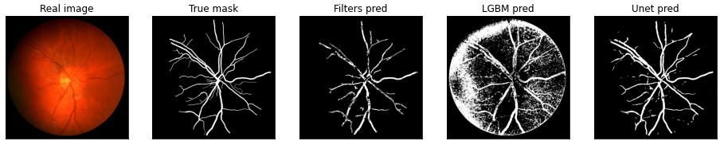

# Retinal Blood Vessels Segmentation
## Table of contents
- [Description](#description)
- [Used libraries](#used-libraries)
- [Image processing](#image-processing)
- [Machine learning](#machine-learning)
- [Deep learning](#deep-learning)
- [Results](#results)

## Description
This project was a part of a Informatics in Medicine university class. The idea was to implement a solution that locates blood vessels in a picture.

## Used libraries
- opencv-python
- numpy
- matplotlib
- sklearn
- imblearn
- lightgbm
- tensorflow
- keras
- patchify

## Image processing
The simplest solution was to use basic image processing techniques. The steps:
1) Use only green channel as it contains the most information
2) Apply CLAHE to increase the contrast
3) Apply morphological transformations
4) Remove the background
5) Reapply CLAHE
6) Threshold the image

## Machine learning
Another solution was to use machine learning algorithms - we chose LightGBM because it's a lightweight and powerful model. The steps:
1) Create a dataset:
    1) Resize the images to 960x960 and select only the green channel
    2) Create 5x5 sliding windows of each image
    3) Get stats of each window (average pixel value, standard deviation, Hu moments)
2) Undersample the dataset as it doesn't fit into memory and is heavily imbalanced (an image contains many more pixels that are not vessels)
3) Train a classifier

## Deep learning
The last solution was to use a deep neural network. We used a bit modified version of a UNET (the last encoder block and the first decoder block were removed).
### Neural network's architecture
The autoencoder consists of encoder and decoder blocks:
```python
kernel_initializer =  'he_uniform'

def conv_block(inputs, num_filters):
    x = Conv2D(num_filters, 3, padding="same", kernel_initializer=kernel_initializer)(inputs)
    x = BatchNormalization()(x)
    x = LeakyReLU()(x)

    x = Conv2D(num_filters, 3, padding="same", kernel_initializer=kernel_initializer)(x)
    x = BatchNormalization()(x)
    x = LeakyReLU()(x)

    return x

def encoder_block(inputs, num_filters):
    x = conv_block(inputs, num_filters)
    p = MaxPool2D((2, 2))(x)
    return x, p

def decoder_block(inputs, skip_features, num_filters):
    x = Conv2DTranspose(num_filters, (2, 2), strides=2, padding="same", kernel_initializer=kernel_initializer)(inputs)
    x = Concatenate()([x, skip_features])
    x = conv_block(x, num_filters)
    return x
```

The final model:
```python
def build_unet(input_shape):
    inputs = Input(input_shape)

    s1, p1 = encoder_block(inputs, 64)
    s2, p2 = encoder_block(p1, 128)
    s3, p3 = encoder_block(p2, 256)

    b1 = conv_block(p3, 1024)

    d2 = decoder_block(b1, s3, 256)
    d3 = decoder_block(d2, s2, 128)
    d4 = decoder_block(d3, s1, 64)

    outputs = Conv2D(1, 1, padding="same", activation="sigmoid")(d4)

    model = Model(inputs, outputs, name="UNET")
    return model
```

### Loss function, optimizer and metrics
As an optimizer we used Adam with a learning rate equal to 0.001.

As a loss function we used dice loss:
```python
def dice_coef(y_true, y_pred):
    smooth = 1e-15
    y_true = tf.keras.layers.Flatten()(y_true)
    y_pred = tf.keras.layers.Flatten()(y_pred)
    intersection = tf.reduce_sum(y_true * y_pred)
    return (2. * intersection + smooth) / (tf.reduce_sum(y_true) + tf.reduce_sum(y_pred) + smooth)

def dice_loss(y_true, y_pred):
    return 1.0 - dice_coef(y_true, y_pred)
```

As metrics, we used:
- accuracy
- recall
- precision
- dice coefficient

### Dataset
We used RGB images. Each image was divided into 64x64 patches.

### Data augmentation
```python
train_img_datagen_params = dict(rotation_range=90,
                                zoom_range=0.2,
                                horizontal_flip=True,
                                width_shift_range=0.3,
                                height_shift_range=0.3,
                                fill_mode='reflect',
                                rescale=1./255
)

train_mask_datagen_params = dict(rotation_range=90,
                                 zoom_range=0.2,
                                 horizontal_flip=True,
                                 width_shift_range=0.3,
                                 height_shift_range=0.3,
                                 fill_mode='reflect',
                                 preprocessing_function=lambda x: np.where(x>0, 1, 0).astype(x.dtype)
)
```

### Training


## Results
### Predictions





### Average metrics for each approach for the test set
- Image processing
    - F1: 0.631
    - Accuracy: 0.949
    - Recall: 0.707
    - Precision: 0.590
    - Specificity: 0.966
- Machine Learning
    - F1: 0.353
    - Accuracy: 0.845
    - Recall: 0.642
    - Precision: 0.254
    - Specificity: 0.857
- Deep Learning
    - F1: 0.744
    - Accuracy: 0.962
    - Recall: 0.869
    - Precision: 0.650
    - Specificity: 0.969